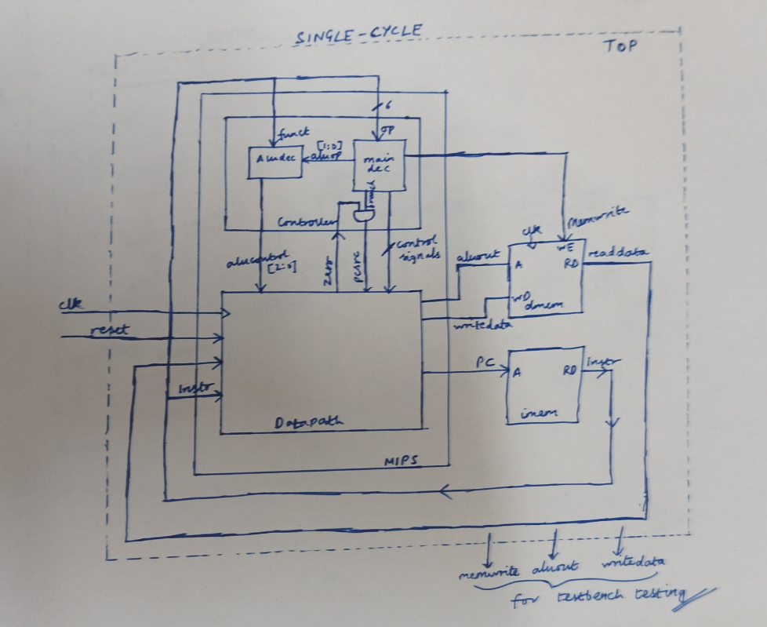
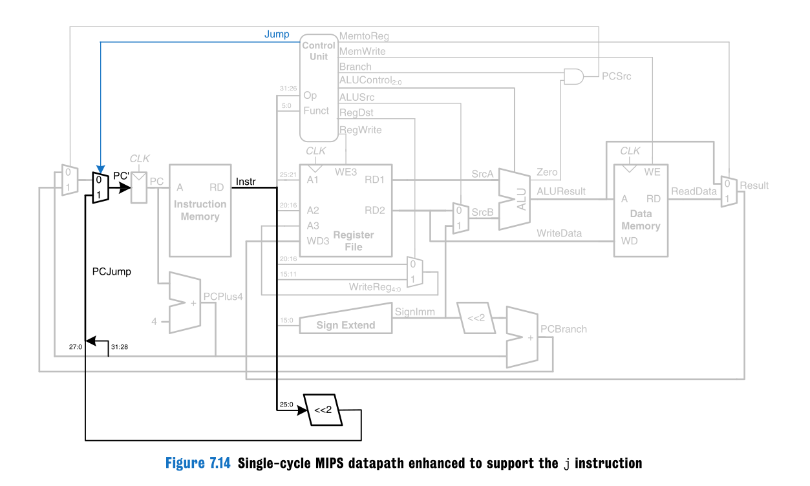
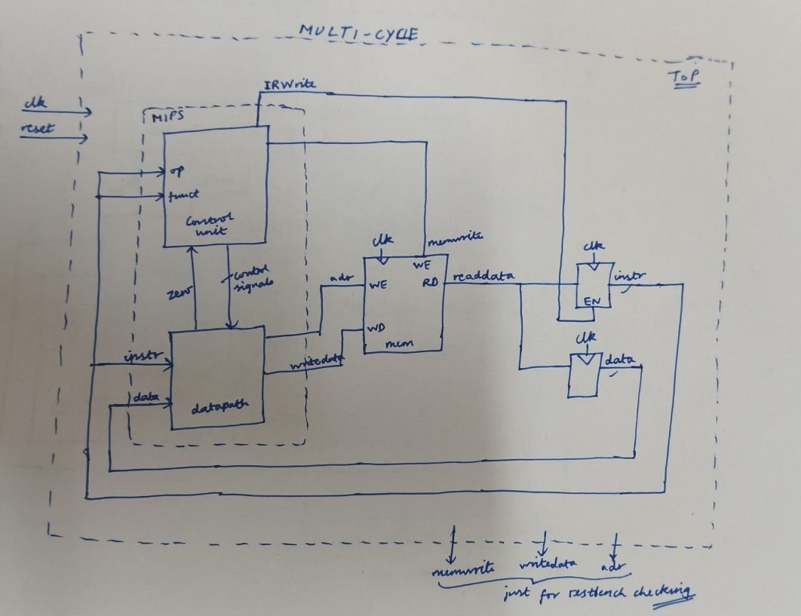
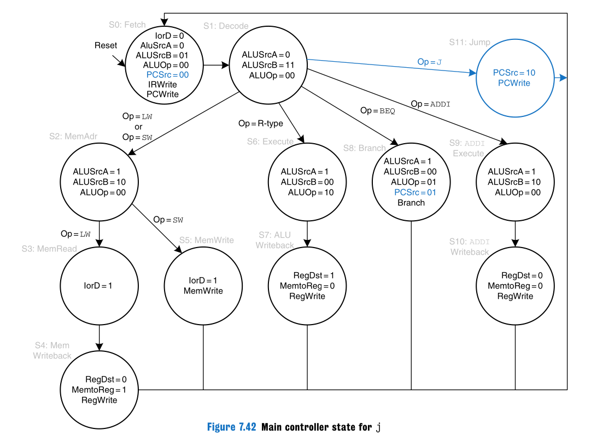
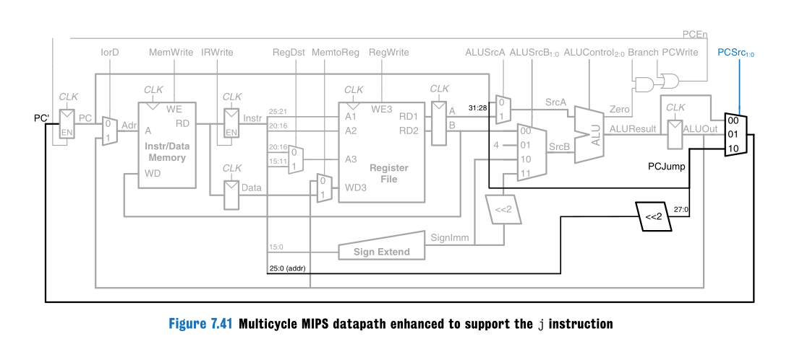
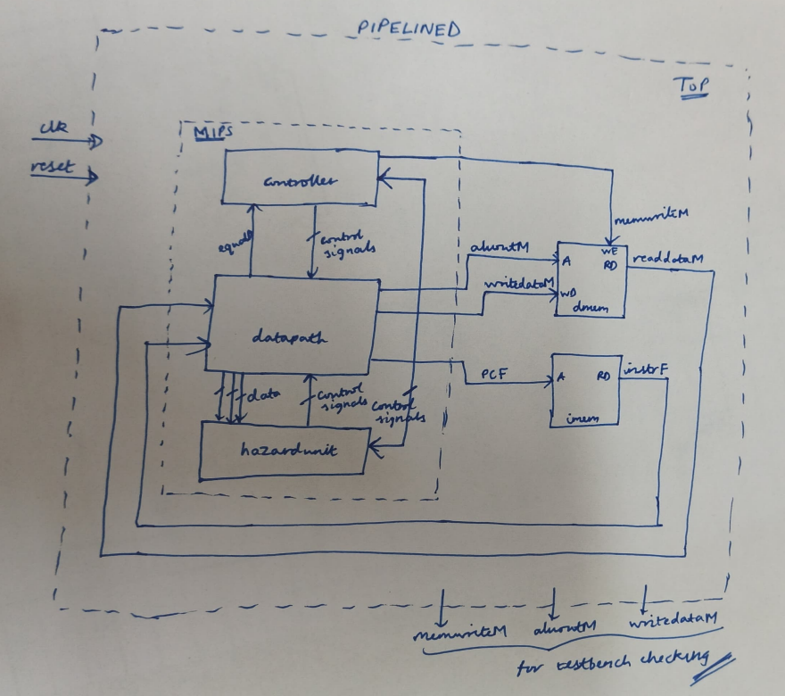
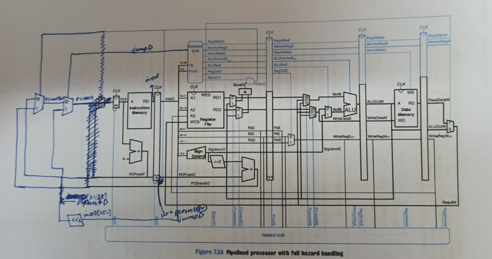

# MIPS Processor — Single-Cycle, Multicycle, Pipelined

A ground-up implementation of a MIPS processor in Verilog, progressing through three microarchitectures. Based on Harris & Harris *Digital Design & Computer Architecture* (Chapter 7).

---

## Jump to

- [Single-Cycle](#single-cycle)
- [Multicycle](#multicycle)
- [Pipelined](#pipelined)
- [How to Simulate](#how-to-simulate)

---

## Repository Structure

```
MIPS_Processor/
├── rtl/          # Verilog source files
├── tb/           # Testbenches
├── mem/          # memfile.dat (instruction memory)
└── images/       # Architecture diagrams
```

Branches: `single_cycle`, `multicycle`, `pipelined` (default)

---

## Single-Cycle

### Architecture





### How it works

- Every instruction executes in a single clock cycle
- The datapath is entirely combinational — PC updates on the clock edge, and all register/memory writes happen at the end of that same cycle
- The controller decodes `op[31:26]` and `funct[5:0]` to produce control signals that steer the datapath muxes

### Implementation

- Controller split into `maindec` (all signals except ALU control, from `op`) and `aludec` (produces `alucontrol` from `aluop` + `funct`)
- Datapath instantiates the register file, ALU, sign extender, shift-left-2, and the PC branch/jump muxes
- Separate `imem` and `dmem` modules live in `top.v`

### Supported instructions

R-type (add, sub, and, or, slt), lw, sw, beq, addi, j

Successfully runs the standard H&H Figure 7.60 test program.

---

## Multicycle

### Architecture







### How it works

- Instructions take multiple clock cycles, one step per cycle: Fetch → Decode → MemAdr/Execute → MemRead/MemWrite/ALUWriteback → Writeback
- Controller is a Moore FSM with 12 states
- Single unified memory handles both instruction fetch and data access — the FSM arbitrates
- Intermediate registers (IR, A, B, ALUout) hold values between cycles

### Implementation

- `maindec` is the FSM coded with the two-always template: combinational next-state logic + clocked state register
- States: S0=Fetch, S1=Decode, then branches per opcode — LW/SW → MemAdr → MemRead/MemWrite → Writeback; R-type → Execute → ALUWriteback; BEQ → Branch; ADDI → Execute → Writeback; J → Jump
- `PCEn = PCwrite | (branch & zero)`
- PC and IR use `flopenr` (flip-flop with enable); other intermediate registers use plain `flopr`

### Supported instructions

R-type (add, sub, and, or, slt), lw, sw, beq, addi, j

Successfully runs the standard H&H Figure 7.60 test program.

---

## Pipelined

### Architecture





### How it works

A 5-stage pipeline (Fetch, Decode, Execute, Memory, Writeback) with full hazard handling — data hazards, load-use hazards, and control hazards are all handled.

**Data hazards** are resolved by a forwarding unit:
- EX/MEM and MEM/WB results bypassed back to EX stage ALU inputs (`forwardAE`, `forwardBE` = 2-bit selects)
- Branch comparator in Decode also has forwarding (`forwardAD`, `forwardBD`) from MEM stage

**Load-use hazards** cannot be resolved by forwarding alone:
- When `lw` is followed immediately by a dependent instruction, a one-cycle stall is inserted
- PC and IF/ID are held (`stallF`, `stallD` = 1), ID/EX is flushed (`flushE` = 1) to insert a bubble

**Branch hazards** — decision moved to Decode stage:
- Equality comparator and branch target adder live in Decode; `pcsrcD = branchD & equalD`
- IF/ID flushed on taken branch (1-cycle penalty)
- `branchstall` inserted if branch source registers not yet available

**Jump** — also resolved in Decode:
- `jumpD` selects `{pcplus4D[31:28], instrD[25:0], 2'b00}` as `pcnextF`
- IF/ID flushed (`clr = pcsrcD | jumpD`); no stall needed — `j` has no register dependencies

### Implementation

- Control signals generated in Decode and pipelined forward through `ID_EX_controlpipe`, `EX_MEM_controlpipe`, `MEM_WB_controlpipe` — data and control pipelines are kept separate to reduce complexity
- `branchD` and `jumpD` are not pipelined — they act immediately in Decode
- Controller is the same as single-cycle, with `jump` added to `maindec`
- Hazard unit is a separate module that monitors register indices and control signals across stages to generate stall and forward signals

### Supported instructions

R-type (add, sub, and, or, slt), lw, sw, beq, addi, j

Successfully runs the standard H&H Figure 7.60 test program.

---

## How to Simulate

### Requirements

You need `iverilog` and `vvp` to simulate. `gtkwave` is optional for waveform viewing.

**Linux (Debian/Ubuntu)**
```bash
sudo apt install iverilog gtkwave
```

**macOS**
```bash
brew install icarus-verilog gtkwave
```

**Windows** — download the installer from [bleyer.org/icarus](http://bleyer.org/icarus/).

### Step 1 — Clone the repo

```bash
git clone https://github.com/vedsavjani/MIPS_Processor.git
cd MIPS_Processor
```

### Step 2 — Choose an implementation

**Single-cycle**
```bash
git checkout single_cycle
```

**Multicycle**
```bash
git checkout multicycle
```

**Pipelined** (default branch)
```bash
git checkout pipelined
```

### Step 3 — Compile and run

```bash
iverilog -g2012 -o sim.vvp rtl/*.v tb/tb.v
vvp sim.vvp
```

### Expected result

All three implementations run the H&H Figure 7.60 test program. A successful run prints:

```
Simulation succeeded
```

This confirms a write of value `7` to address `84` (`mem[21]`).

### Viewing waveforms

```bash
gtkwave dump.vcd
```

### Note on memory warning

```
WARNING: $readmemh: Not enough words in the file for the requested range [0:63].
```

This is harmless. `memfile.dat` is not padded to 64 words. The program ends with `beq $0,$0,-1` which acts as an infinite loop, preventing execution past the loaded instructions.

---

## References

Harris, D. & Harris, S. *Digital Design and Computer Architecture*, 2nd edition. Chapters 6–7.